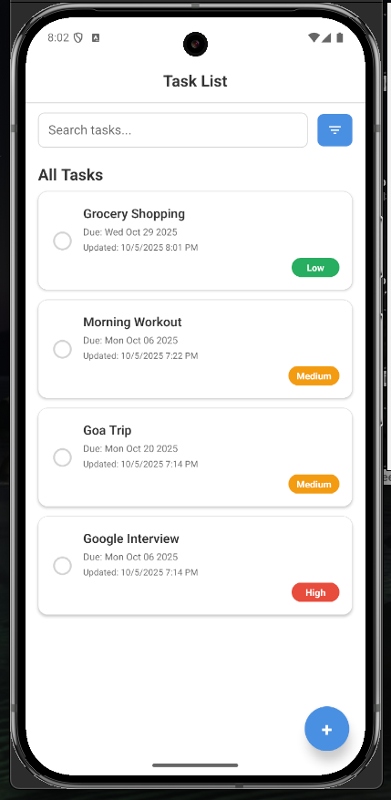
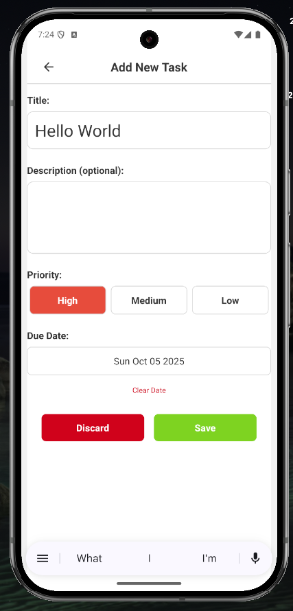
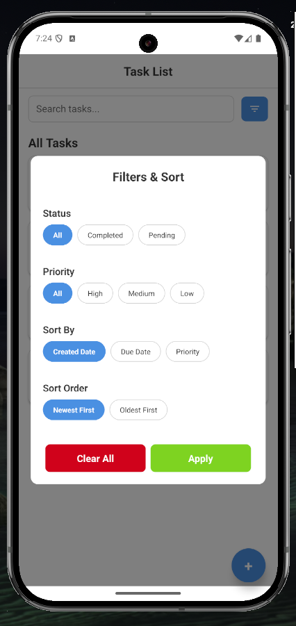
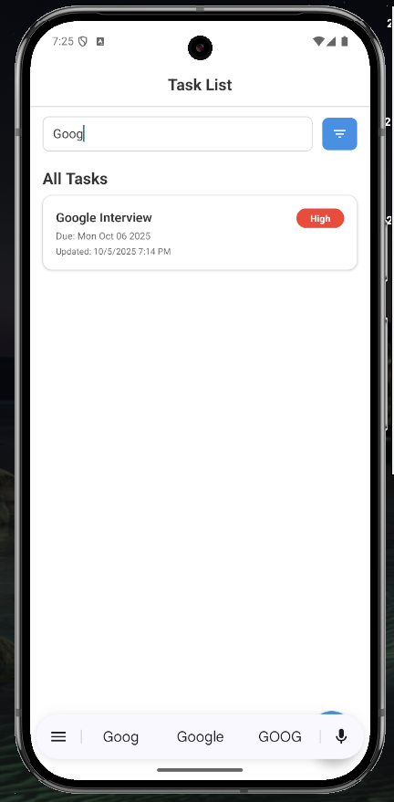
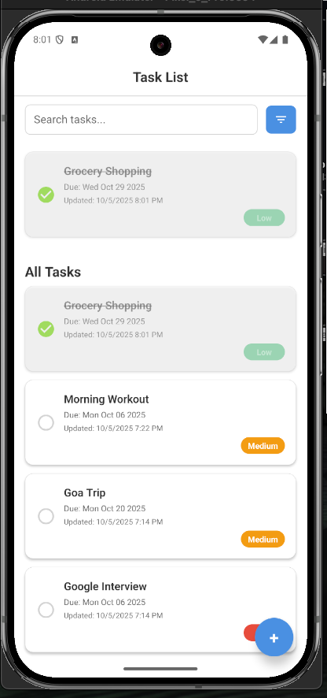

# 📋 NoteTask - Task Manager App

A simple and intuitive task management application built with React Native. Keep track of your daily tasks with ease — create, edit, search, filter, and receive timely reminders.

---

## ✨ Features

- ✅ **Add Tasks** – Create new tasks with title, description, priority, due date, and category  
- 📝 **Edit Tasks** – Update existing tasks anytime  
- 🔍 **Search** – Quickly find tasks with a built-in search bar  
- 🧩 **Advanced Filtering & Sorting**  
  - Filter by **status**, **priority**, or **category**  
  - Sort by **creation date**, **due date**, or **priority**  
- 🕓 **Recently Completed** – View your latest completed tasks in a dedicated section  
- 💾 **Offline Storage** – Local storage using SQLite  
- ⚠️ **Error Handling** – User-friendly alerts for database operation failures  
- 🔔 **Push Notifications** – Receive task reminders via Firebase Cloud Messaging (FCM)  
- 🎨 **Clean UI** – Simple, responsive, and user-friendly interface  

---

## 🛠 Tech Stack

| Tech                     | Description                                 |
|--------------------------|---------------------------------------------|
| React Native             | Cross-platform mobile development           |
| TypeScript               | Type-safe JavaScript                        |
| Redux Toolkit            | Scalable and maintainable state management  |
| SQLite                   | Local database for persistent storage       |
| React Navigation         | Declarative screen navigation               |
| Firebase Cloud Messaging | Push notifications                          |
| react-native-vector-icons| Icon library                                |
| react-native-modal       | Custom modal dialogs                        |

---

## 📸 Screenshots

> Replace these with your actual screenshots in the `/screenshots` folder.

- **Task List Screen**  
  

- **Add/Edit Task Screen**  
  

- **Filter Modal**  
  

- **Search Section**  
  

- **Search Section**  
  

---

## 🚀 Getting Started

### 📦 Installation

# Clone the repository
git clone <your-repo-url>
cd task-manager-app

# Install dependencies
yarn install
# or
npm install

# iOS only: install CocoaPods
cd ios && pod install && cd ..

▶️ Running the App

# Run on Android
npx react-native run-android

# OR run on iOS
npx react-native run-ios

📁 Project Structure

src/
├── components/          # Reusable UI components (TaskCard, FilterModal, etc.)
├── screens/             # App screens (TaskListScreen, AddEditTaskScreen)
├── redux/
│   ├── slice/           # Redux slices (taskSlice, filterSlice)
│   └── store.ts         # Redux store setup
├── db/                  # SQLite database logic
├── theme/               # Styling (colors, typography)
└── utils/               # Error handling and helper functions

⚙️ How It Works

🧠 State Management

    - taskSlice manages task CRUD operations using async thunks and error handling.
    - filterSlice manages filters and sorting preferences.
    - Selectors are used to get filtered, sorted, and recently completed tasks.

💾 Database

    - SQLite stores tasks in a local database.
    - db.ts handles table creation, insertion, updates, deletions, and queries.

🔄 UI Flow

    - TaskListScreen: Includes a search bar, filter button (opens FilterModal), shows recent completions, and displays tasks.
    - AddEditTaskScreen: Allows creating or editing a task with all relevant fields.

❗ Error Handling

All DB operations are wrapped in try/catch and handled with a centralized handleError utility that alerts users.

🌱 Future Improvements

🔄 Persist filter & sort preferences in AsyncStorage
🌙 Dark mode support
✅ Unit and integration tests
🕑 Enhanced push notification scheduling